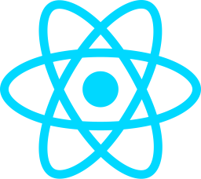

:::tip

We have getting started guides for the following frameworks:

###  [React](/getting-started/react/create-project)

###  [Vanilla JavaScript](/getting-started/vanilla-js/create-project)

###  Vue (coming soon!)

The first two sections for any framework only take 90 seconds to complete.

:::
