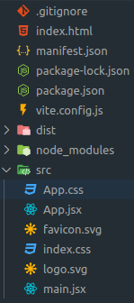
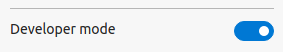
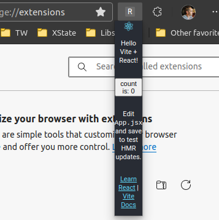

# Get Started with React

This 90 second guide will get you up and running with a Chrome Extension popup
page. You'll see how to integrate CRXJS with Vite, then explore Vite HMR in a
extension HTML page.

## Create a Vite project

Use your favorite package manager to scaffold a new project and follow the
prompts to create a React project.

```sh
npm init vite@latest
```

## Install CRXJS Vite plugin

Now install the CRXJS Vite plugin using your favorite package manager.

```sh
npm i @crxjs/vite-plugin -D
```

## Update the Vite config

Update `vite.config.js` to match the code below.

```js title=vite.config.js
import { defineConfig } from 'vite'
import react from '@vitejs/plugin-react'
// highlight-start
import { crx } from '@crxjs/vite-plugin'
import manifest from './manifest.json'
// highlight-end

export default defineConfig({
  plugins: [
    react(),
    // highlight-next-line
    crx({ manifest }),
  ],
})
```

Create a file named `manifest.json` next to `vite.config.js`.

```json title=manifest.json
{
  "manifest_version": 3,
  "name": "CRXJS React Vite Example",
  "version": "1.0.0",
  "action": { "default_popup": "index.html" }
}
```

And run the dev command.

```sh
npm run dev
```

That's it! CRXJS will do the rest. Your project directory should look like this:



## Add the extension to Chrome

Let's try it out.

When the build completes, open Chrome or Edge and navigate to
`chrome://extensions`. Make sure to turn on the developer mode switch.

| Chrome                                                                | Edge                                                              |
| --------------------------------------------------------------------- | ----------------------------------------------------------------- |
|  |  |
| Located in top right corner                                           | Located in left sidebar                                           |

Drag your `dist` folder into the Extensions Dashboard to install it. Your
extension icon will be in the top bar. The icon will be the first letter of the
extension's name.

<!-- TODO: update manifest with {name: CRXJS Vite React Example} -->


## Profit with Vite HMR

Once you've found the extension icon, right-click it and choose "Inspect popup
window". This will open the popup and the popup dev tools window. We need to
inspect the popup to keep it open while making changes.



That popup is pretty tiny; let's add some CSS to make it wider.

```css title=App.css
.App {
  text-align: center;
  // highlight-next-line
  min-width: 350px;
}
```

And boom! HMR magic at work.


