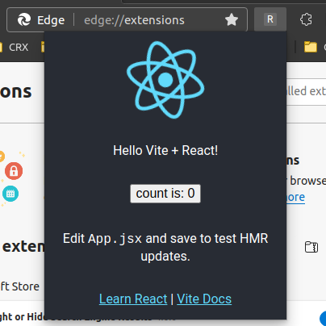

import Intro from '../\_dev-basics-intro.md'

# Development Basics with React

<Intro/>

## Install the extension

When the build completes, open Chrome or Edge and navigate to
`chrome://extensions`. Make sure to turn on the developer mode switch.

| Chrome                                                                | Edge                                                              |
| --------------------------------------------------------------------- | ----------------------------------------------------------------- |
|  |  |
| Located in top right corner                                           | Located in left sidebar                                           |

Drag your `dist` folder into the Extensions Dashboard to install it. Your
extension icon will be in the top bar. The icon will be the first letter of the
extension's name.

<!-- TODO: update manifest with {name: CRXJS Vite React Example} -->


## Profit with Vite HMR

Once you've found the extension icon, right-click it and choose "Inspect popup
window". This will open the popup and the popup dev tools window. We need to
inspect the popup to keep it open while making changes.


That popup is pretty tiny; let's add some CSS to make it wider.

```css title=App.css
.App {
  text-align: center;
  // highlight-next-line
  min-width: 350px;
}
```

And boom! HMR magic at work.


