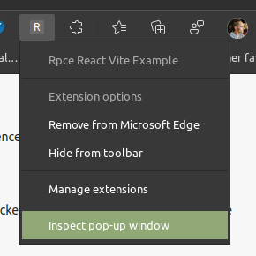

import Intro from '../\_dev-basics-intro.md';

import Installing from '../\_install-extension.md';

# Development Basics with React

<Intro/>

## Opening the extension

<Opening/>

## Profit with Vite HMR

Once you've found the extension icon, right-click it and choose "Inspect popup
window". This will open the popup and the popup dev tools window. We need to
inspect the popup to keep it open while making changes.

And boom! HMR magic at work.

