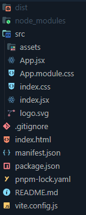

# Get Started with Solid

This quick guide will get you up and running with a Chrome Extension popup page.
You'll see how to integrate CRXJS with Vite, then explore Vite HMR in an
extension Solid HTML page. The first two sections take about 90 seconds!

## Create a Vite project

Use your favorite package manager to scaffold a new project and follow the
prompts to create a Solid project.

```sh
npx degit solidjs/templates/js vite-solid-crxjs
```

### Typescript

```sh
npx degit solidjs/templates/ts vite-solid-crxjs
```

## Install CRXJS Vite plugin

Now install the CRXJS Vite plugin using your favorite package manager.

```sh
npm i @crxjs/vite-plugin -D
```

## Update the Vite config

Update `vite.config.js` to match the code below.

```js title=vite.config.js
import { defineConfig } from 'vite'
import solidPlugin from "vite-plugin-solid";
// highlight-start
import { crx } from '@crxjs/vite-plugin'
import manifest from './manifest.json'
// highlight-end

export default defineConfig({
  plugins: [
    solidPlugin(), 
    // highlight-next-line
    crx({ manifest })
  ],
});

```

Create a file named `manifest.json` next to `vite.config.js`.

```json title=manifest.json
{
  "manifest_version": 3,
  "name": "CRXJS Solid Vite Example",
  "version": "1.0.0",
  "action": { "default_popup": "index.html" }
}
```

## First development build

Time to run the dev command. 🤞

```sh
npm run dev
```

That's it! CRXJS will do the rest.

Your project directory should look like this:



Next, we'll load the extension in the browser and give the development build a
test run.
