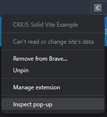
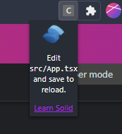

import Intro from '../\_dev-basics-intro.md';

import Installing from '../\_install-extension.md';

# Development Basics with Solid

<Intro/>

## Install the extension

<Installing/>



## Profit with Vite HMR

Once you've found the extension icon, right-click it and choose "Inspect popup
window". This will open the popup and the popup dev tools window. We need to
inspect the popup to keep it open while making changes.



That popup is pretty tiny; let's add some CSS to make it wider.

```css title=App.module.css
.App {
  text-align: center;
  // highlight-next-line
  min-width: 350px;
}
```

And boom! HMR magic at work.


