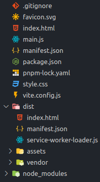

import CreateProjectTabs from '../\_create-project-tabs.mdx'

# Get Started with Vanilla JS

Sometimes you don't want to use a framework for your Chrome Extension, or you
want to add a framework later.

:::tip no framework?

Vite and CRXJS don't require you to choose a JS framework to get started. Vite
still provides HMR for CSS, and your JavaScript changes will trigger a full page
reload.

:::

<CreateProjectTabs />

## Create a Vite config file

Create `vite.config.js` with the code below.

```js title=vite.config.js
import { defineConfig } from 'vite'
import { crx } from '@crxjs/vite-plugin'
import manifest from './manifest.json'

export default defineConfig({
  plugins: [crx({ manifest })],
})
```

Create a file named `manifest.json` next to `vite.config.js`.

```json title=manifest.json
{
  "manifest_version": 3,
  "name": "CRXJS Vanilla JS Example",
  "version": "1.0.0",
  "action": { "default_popup": "index.html" }
}
```

And run the dev command in the terminal.

```sh
npm run dev
```

That's it! CRXJS will do the rest. Your project directory should look like this:



Next, we'll load the extension in the browser and give the development build a
test run.
