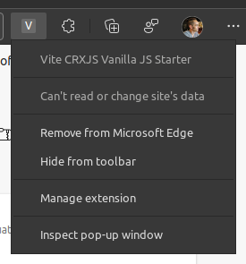
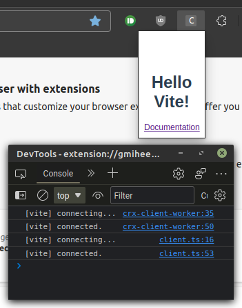
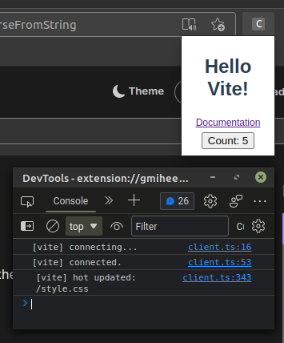

import Intro from '../\_dev-basics-intro.md'

import Installing from '../\_install-extension.md'

# Development Basics with Vanilla JS

<Intro/>

## Install the extension

<Installing/>



## Inspect the popup

Once you've found the extension icon, right-click it and choose "Inspect popup
window". This menu item will open the popup and the popup dev tools window. We
need to inspect the popup to keep it open while making changes.



## Vite HMR for JavaScript

Let's see how Vite handles JavaScript updates without an HMR framework. We can
add a counter button to test how Vite preserves the page state.

```javascript title=main.js
import './style.css'

document.querySelector('#app').innerHTML = `
  <h1>Hello Vite!</h1>
  <a href="https://vitejs.dev/guide/features.html" target="_blank">Documentation</a>
  // highlight-next-line
  <button>Count: 0</button>
`

// highlight-start
let count = 0
const button = document.querySelector('#app button')
button.addEventListener('click', () => {
  count++
  button.textContent = `Count: ${count}`
})
// highlight-end
```

Vite will trigger a full page reload when we save our file. The popup will stay
open since the devtools inspector is open. Our button is there, but the elements
look a little squashed.


## Vite HMR for CSS

HTML and JS changes trigger full page reloads, but Vite provides HMR updates for
imported styles _without_ a full page reload. Click that counter a few times and
then update `styles.css` to fix the page layout.

```css title=styles.css
#app {
  font-family: Avenir, Helvetica, Arial, sans-serif;
  text-align: center;
  color: #2c3e50;
  // highlight-next-line
  margin-top: 60px; /* Remove this line */

  // highlight-start
  width: 100px;
  display: flex;
  flex-direction: column;
  justify-content: center;
  align-items: center;
  row-gap: 5px;
  // highlight-end
}
```

Vite will update the styles while preserving the counter state. Pretty good for
a vanilla JavaScript project!


