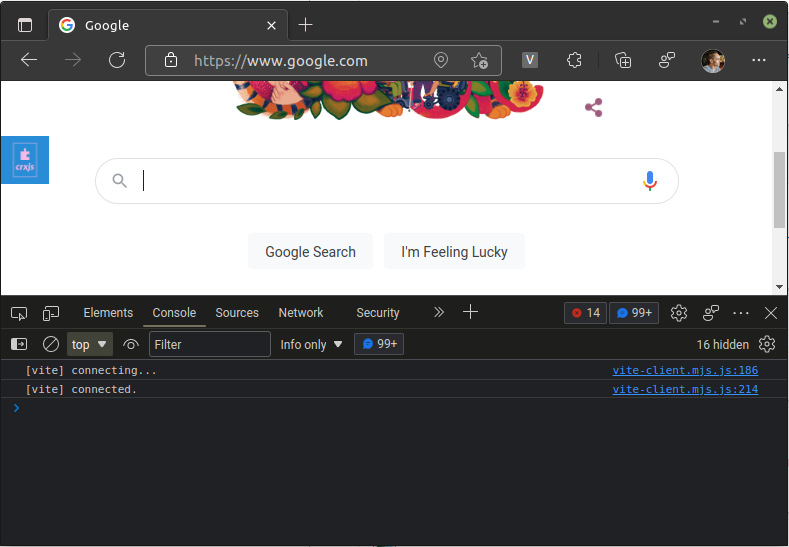
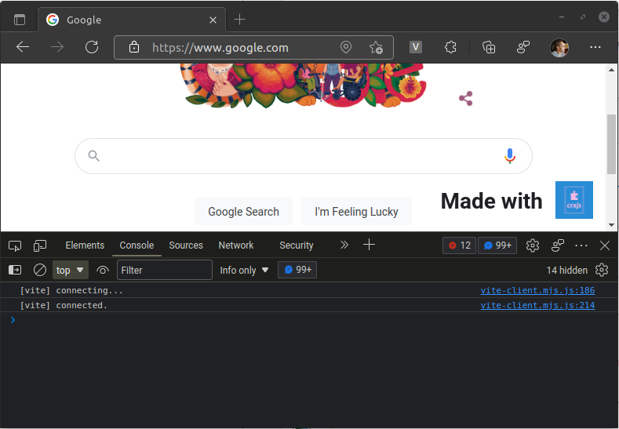

# Working with Content Scripts

Make sure that your extension is [loaded in the browser](dev-basics) and that
you've started Vite in the terminal. Navigate to `https://www.google.com` in the
browser.

## First steps

Our image appears on the left side of the window, in a somewhat random location.



## Vite HMR for CSS

Let's turn the image into a floating badge using the following CSS.

```css title=src/content.js
// highlight-start
.crx {
  position: fixed;
  bottom: 1rem;
  right: 1rem;

  display: flex;
  align-items: center;
  justify-content: center;
  column-gap: 1rem;
}
// highlight-end

.crx img {
  width: 3rem;
  height: 3rem;
}
```

CRXJS will quickly rebuild the content script, and our CSS changes will take
effect _without reloading the page_.

If you look at the developer console of the page, you can see the familiar
`[vite] hot updated: /src/content.css.js` message.


## Vite HMR for JavaScript

We can add an `h1` tag next to the image to test HMR in a content script. Update
the code in `content.js` :

```javascript title=src/content.js
import logo from './crxjs-logo.png'
import './content.css'

const html = `
<div class="crx">
// highlight-next-line
  <h1>Made with</h1>
  
</div>
`

const doc = new DOMParser().parseFromString(html, 'text/html')
document.body.append(doc.body.firstChildElement)
```

Since we're not using a framework that supports HMR, Vite will trigger a full
page reload when you save the file.


