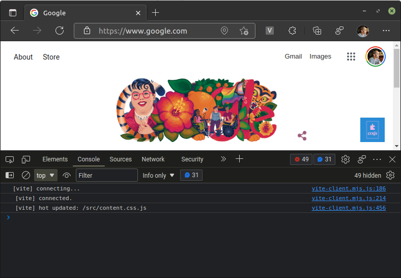

import DefineContentScript from '../\_define-content-script.md'

CRXJS brings an authentic Vite HMR experience to content scripts. Let's add a
plain JavaScript content script to your Chrome Extension.

<DefineContentScript/>

## Declare a content script

We declare content scripts in the manifest with a list of JavaScript files and
match patterns. Match patterns represent the pages where Chrome should execute
our content script. In `manifest.json`, create the field `content_scripts` with
an array of objects:

```json title=manifest.json
{
  // other fields...
  "content_scripts": [
    {
      "js": ["src/content.js"],
      "matches": ["https://www.google.com/*"]
    }
  ]
}
```

Here we're telling Chrome to execute `src/content.js` on all pages that start
with `https://www.google.com`. In this case, the Google homepage is the content
script's host page.

## Add an visual element

We're not using a framework, but we can use plain JavaScript to add the
[CRXJS logo](./assets/image.png) to a host page. Notice how Vite still allows
you to import CSS files and static assets even though you're not using a
framework!

```javascript title=src/content.js
import src from './image.png'
import './content.css'

const html = `
<div class="crx">
  
</div>
`

const doc = new DOMParser().parseFromString(html, 'text/html')
document.body.append(doc.body.firstElementChild)
```

```css title=src/content.css
.crx img {
  width: 3rem;
  height: 3rem;
}
```

## Get the right URL

Content scripts share the origin of their host page. We need to get a URL with
our extension id for static assets like images. Let's go to `src/content.js` and
do that now.

```html title="An imported asset path won't work"

```

```html title="Use chrome.runtime.getURL() to get the right url"

```

Now our content script is ready for action!

## Profit with Vite HMR

Make sure that your extension is loaded in the browser and that you've started
Vite in the terminal. Navigate to `https://www.google.com` in the browser and
our image in a somewhat random location to the left.


Let's turn the image into a floating badge.

```css title=src/content.js
// highlight-start
.crx {
  position: fixed;
  bottom: 1rem;
  right: 1rem;

  display: flex;
  align-items: center;
  justify-content: center;
  column-gap: 1rem;
}
// highlight-end

.crx img {
  width: 3rem;
  height: 3rem;
}
```

CRXJS will quickly rebuild the content script, and our CSS changes will take
effect _without reloading the page_. If you look at the developer console of the
page, you can see the familiar `[vite] hot updated: /src/content.css.js`
message.



We can add an `h1` tag next to the image to test HMR in a content script. Update
the code in `content.js` :

```javascript title=src/content.js
import logo from './crxjs-logo.png'
import './content.css'

const html = `
<div class="crx">
// highlight-next-line
  <h1>Made with</h1>
  
</div>
`

const doc = new DOMParser().parseFromString(html, 'text/html')
document.body.append(doc.body.firstChildElement)
```

Since we're not using a framework that supports HMR, Vite will trigger a full
page reload when you save the file.


